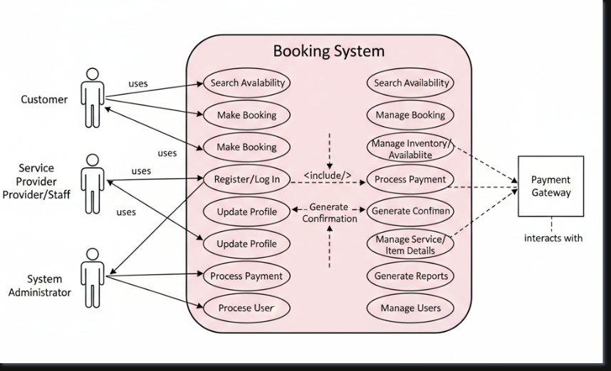

# Requirement Analysis in Software Development

## 📘 Introduction
This repository explores **Requirement Analysis**, a crucial phase in the Software Development Lifecycle (SDLC).  
The purpose of this repository is to document, analyze, and illustrate the processes involved in understanding and defining project requirements.

Through this project, we will:
- Understand what Requirement Analysis is.
- Identify why it is essential in software projects.
- Explore key activities such as gathering, elicitation, documentation, modeling, and validation.
- Learn about different types of requirements (functional and non-functional).
- Create visual representations like **Use Case Diagrams**.
- Define **Acceptance Criteria** to ensure project alignment with user and business goals.

This repository serves as a **blueprint for mastering requirement analysis** and building a strong foundation for any successful software development project.

## 🧩 What is Requirement Analysis?

**Requirement Analysis** is the process of identifying, documenting, and analyzing the needs and expectations of stakeholders for a software system.  
It serves as the **foundation of the Software Development Lifecycle (SDLC)** because it defines *what* the system must do before any design or coding begins.

During this phase, developers, business analysts, and stakeholders collaborate to ensure that:
- The system’s goals are clearly understood.
- Functional and non-functional requirements are well-defined.
- Any ambiguities or conflicts in requirements are resolved early.

In simpler terms, Requirement Analysis is about **understanding the problem before building the solution**.  
It bridges the gap between the client’s vision and the developer’s implementation plan.

### 🧠 Key Goals:
- Ensure that the project’s scope and expectations are clear.
- Minimize misunderstandings between clients and developers.
- Provide a roadmap that guides all subsequent stages of development.

- ## 💡 Why is Requirement Analysis Important?

Requirement Analysis plays a vital role in ensuring the success of any software project.  
It helps developers, project managers, and stakeholders build a shared understanding of what needs to be developed and why.

Here are some of the main reasons why this phase is so important:

### 1️⃣ Prevents Costly Mistakes
When requirements are unclear or misunderstood, it can lead to rework, project delays, or even total failure.  
Requirement Analysis ensures that expectations are aligned before development begins, reducing the cost of fixing errors later.

### 2️⃣ Improves Communication and Collaboration
By documenting requirements clearly, all stakeholders — including clients, users, and developers — stay on the same page.  
This promotes effective communication and helps prevent scope creep or confusion during the project.

### 3️⃣ Ensures Product Quality and User Satisfaction
Clearly defined requirements help developers build a system that meets user needs and business objectives.  
It ensures that the final product solves the right problem and delivers real value to its users.

### 4️⃣ Provides a Strong Foundation for Design and Development
Requirement Analysis acts as a blueprint for the next SDLC phases.  
A well-documented set of requirements allows the design, development, and testing teams to work more efficiently and with fewer uncertainties.

## 🔍 Key Activities in Requirement Analysis

The Requirement Analysis phase involves several important activities that help teams clearly define what the system should achieve.  
Each activity builds on the previous one to ensure a clear, complete, and accurate understanding of the project needs.

### 1️⃣ Requirement Gathering
This involves collecting information from stakeholders, users, and other sources to understand what they expect from the system.  
Common techniques include **interviews, surveys, questionnaires, brainstorming sessions,** and **document reviews**.

### 2️⃣ Requirement Elicitation
Elicitation goes deeper than gathering — it focuses on drawing out hidden or unstated requirements through interaction and observation.  
This step ensures that both **explicit and implicit needs** are captured.

### 3️⃣ Requirement Documentation
All gathered and elicited requirements are documented in a structured format such as a **Software Requirement Specification (SRS)** document or product backlog.  
Good documentation ensures that all stakeholders have a consistent understanding of what will be built.

### 4️⃣ Requirement Analysis and Modeling
This step involves examining the documented requirements for feasibility, clarity, and consistency.  
Developers may use **models, diagrams, or flowcharts** to visualize the system and validate relationships between different components.

### 5️⃣ Requirement Validation
Validation ensures that the documented requirements truly reflect stakeholder needs.  
Through **reviews, walkthroughs, and prototype testing**, the team confirms that the system’s goals are correctly understood and agreed upon before development begins.

## ⚙️ Types of Requirements

In software development, requirements are generally divided into two main categories: **Functional Requirements** and **Non-Functional Requirements.**  
Both are essential to building a complete, efficient, and user-friendly system.

---

### 🧩 Functional Requirements
Functional requirements describe **what the system should do.**  
They define the specific behaviors, functions, and features that allow the system to meet user needs.

For a **Booking Management System**, examples include:
- Users should be able to **create an account** and **log in securely.**
- The system should allow customers to **search for available rooms or services.**
- Users can **book, modify, or cancel** reservations.
- The system should **generate booking confirmation receipts** after a successful transaction.
- Admins should be able to **view, approve, or reject** bookings.
- The system should send **email or SMS notifications** upon successful booking or cancellation.

These functions define **how the system behaves** in response to user actions.

---

### ⚡ Non-Functional Requirements
Non-functional requirements define **how the system performs** its functions rather than what it does.  
They set the quality standards that ensure usability, reliability, and performance.

For a **Booking Management System**, examples include:
- **Performance:** The system should handle up to 500 concurrent users without lag.  
- **Security:** All user data should be encrypted, and passwords must be stored securely.  
- **Availability:** The platform should maintain at least 99.9% uptime.  
- **Scalability:** The system should support future expansion, such as additional booking categories or locations.  
- **Usability:** The interface should be intuitive and responsive across all devices.  
- **Backup & Recovery:** The system should perform automatic daily backups to prevent data loss.

---

Functional requirements define **what the system must do**, while non-functional requirements ensure it does those tasks **effectively, efficiently, and reliably.**

## 🎭 Use Case Diagrams

A **Use Case Diagram** is a visual representation of how different **actors** (users or external systems) interact with a system.  
It helps identify the **main functions** (use cases) that the system should support and shows **who does what** within the system.

Use Case Diagrams are especially valuable in the **Requirement Analysis phase** because they:
- Provide a clear, high-level overview of the system’s functionality.
- Help communicate system requirements between stakeholders and developers.
- Make it easier to identify user roles, interactions, and dependencies.

---

### 🧩 Example: Booking Management System

Below is a Use Case Diagram representing a **Booking Management System**.  
It shows how different users (customers, administrators, and payment services) interact with the system.

---

### 🧠 Key Actors & Use Cases

**Actors:**
- **Customer:** Makes, modifies, or cancels a booking.
- **Admin:** Manages booking records and user information.
- **Payment Gateway:** Handles online transactions securely.

**Use Cases:**
- Search for available bookings.
- Create a booking.
- Make a payment.
- Receive booking confirmation.
- Modify or cancel booking.
- View booking history.
- Manage users and availability (Admin).

This diagram helps visualize the flow of interactions and ensures that all essential system behaviors are accounted for before design and implementation.

## ✅ Acceptance Criteria

**Acceptance Criteria** are a set of predefined conditions that a software product or feature must meet to be accepted by the user, client, or stakeholders.  
They act as a bridge between **requirements** and **testing**, ensuring that every feature works as intended and meets business goals.

Acceptance Criteria help:
- Clarify what needs to be built and how success will be measured.
- Prevent misunderstandings between developers, testers, and stakeholders.
- Define when a feature is considered “done.”
- Support the creation of test cases for verification and validation.

---

### 🧩 Example: Checkout Feature (Booking Management System)

**Feature Description:**  
Allow a customer to securely pay for a booking and receive confirmation.

**Acceptance Criteria:**
1. The user must be able to view their booking summary before making payment.  
2. The system must accept multiple payment methods (credit/debit card, mobile money, PayPal).  
3. Payment information must be transmitted securely using HTTPS.  
4. On successful payment, the system should generate a confirmation message and booking reference number.  
5. If the payment fails, an error message should display, and no booking should be confirmed.  
6. The booking status must update automatically to “Confirmed” upon successful payment.  
7. The customer should receive an email confirmation immediately after a successful transaction.

---

### 🧠 Why It Matters

By defining **Acceptance Criteria**, both the development and QA teams have a **clear definition of “done”** for each feature.  
This ensures alignment between the technical implementation and user expectations, minimizing rework and improving product quality.
